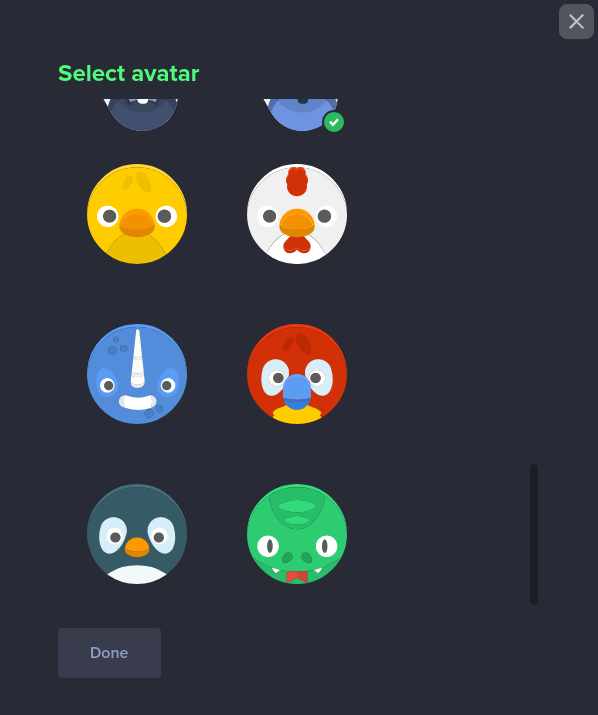

# Animal Avatars for [ARK Desktop Wallet](https://ark.io/wallet)

> A collection of custom animal avatars to show in the [ARK Desktop Wallet](https://ark.io/wallet).

## Installation

1. Clone this repository or [download it](https://github.com/brenopolanski/animal-avatars-ark-wallet/archive/master.zip) and unzip it into `~/.ark-desktop/plugins/`.
2. Start the desktop wallet.
3. Enable the plugin on the plugin section.
4. Go to edit profile and choose a new animal avatar.

## Team

This plugin is maintained by the following person(s) and a bunch of [awesome contributors](https://github.com/brenopolanski/dracula-theme-ark-wallet/graphs/contributors).

| 
| :---: |
| [Breno Polanski](https://github.com/brenopolanski) |

## Contributing

If you want to help, please read the [Contributing](./CONTRIBUTING.md) guide.

## Credits

- [Kenney - Animal Pack Redux](https://kenney.nl/assets/animal-pack-redux)

## License

[MIT License](https://brenopolanski.mit-license.org/) © Breno Polanski
